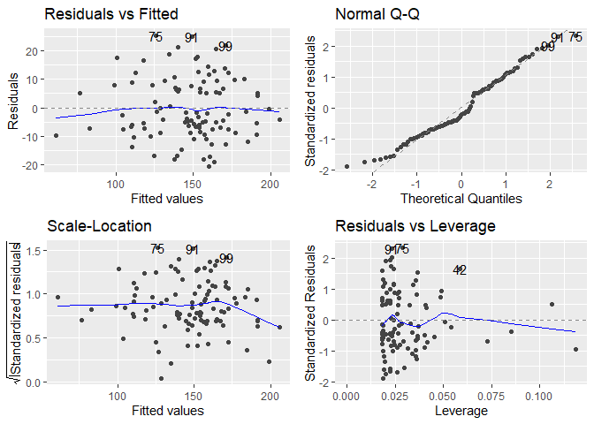
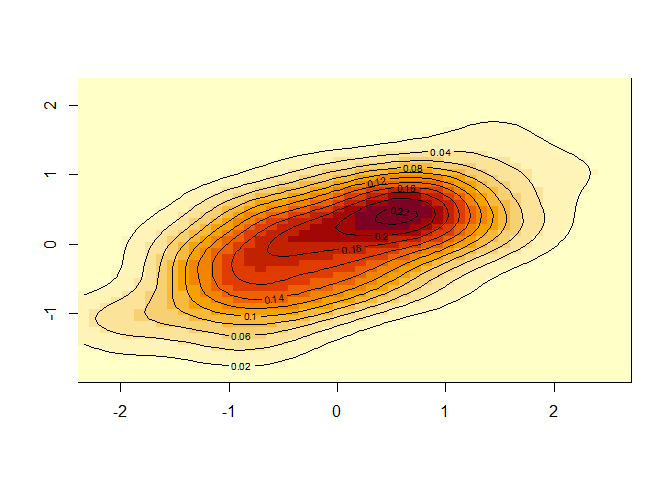

portfolio7
================
Yoo Ri Hwang
3/9/2022

## Overview

In this portfolio, I aim to be familair with *basic* simulation

## Source & Reference

1.  Introducing Monte Carlo Methods with R (Robert & Casella, 2010)
2.  <https://towardsdatascience.com/generate-simulated-dataset-for-linear-model-in-r-469a5e2f4c2e>  
    **3)
    <https://datascience4psych.github.io/DataScience4Psych/welcome-to-simulating-data.html>**
3.  <https://cran.r-project.org/web/packages/holodeck/vignettes/simulating-data.html>  
4.  <https://blog.revolutionanalytics.com/2016/02/multivariate_data_with_r.html>  

<!-- -->

6.  <https://s3.amazonaws.com/assets.datacamp.com/production/course_6521/slides/chapter2.pdf>

## packages

``` r
library(ggfortify)
```

    ## Loading required package: ggplot2

``` r
# install.packages('ggfortify')
```

## Univariate Normal & the one-sample t-test

``` r
x<-rnorm(25, mean=0, sd=100)
# produce N(0.3, 20) sample of size 25. 
print(x)
```

    ##  [1]  199.3313512 -122.6811957  220.7329404   49.3988072  -37.5684275
    ##  [6]  -13.0953656   87.5846821 -113.6742186   -0.4477755  108.0133715
    ## [11]   66.7806869    3.0815609    2.3273561   42.0555916  -45.2653164
    ## [16]  126.9653789 -176.5980182   -9.1210915   64.6598558   94.1901379
    ## [21]   99.7017422  -24.0209374  -56.8663908  236.5744346    4.0663251

``` r
t.test(x) # one sample t-test to see if the true mean score would be 0 or not 
```

    ## 
    ##  One Sample t-test
    ## 
    ## data:  x
    ## t = 1.5726, df = 24, p-value = 0.1289
    ## alternative hypothesis: true mean is not equal to 0
    ## 95 percent confidence interval:
    ##  -10.07469  74.56472
    ## sample estimates:
    ## mean of x 
    ##  32.24502

``` r
#p-value: 0.99. 
```

Although I generate the x data to be mean of zero, Sd was
unrealistically high.

``` r
y<-rnorm(25, mean=0, sd=1)
# produce N(0.3, 20) sample of size 25. 
print(y)
```

    ##  [1] -0.28285953 -0.11701104 -0.90376571  0.45155970  1.36677121 -1.80999971
    ##  [7]  0.04622318 -0.37486600  0.78566916  0.54922383  0.58092829  1.59334756
    ## [13] -1.51426422 -0.17392026  0.34314782 -2.53206786  0.41661949 -0.80641238
    ## [19] -1.60805695 -0.99071384  2.84322585  0.02628961 -1.01449536  0.48705816
    ## [25]  1.79969160

``` r
t.test(y) # one sample t-test to see if the true mean score would be 0 or not 
```

    ## 
    ##  One Sample t-test
    ## 
    ## data:  y
    ## t = -0.13695, df = 24, p-value = 0.8922
    ## alternative hypothesis: true mean is not equal to 0
    ## 95 percent confidence interval:
    ##  -0.5391094  0.4720153
    ## sample estimates:
    ##  mean of x 
    ## -0.0335471

``` r
#p-value becomes much lower than t.test(x)
```

## Simple regression

``` r
set.seed(1)
x=seq(-3,3,le=5)
print(x)
```

    ## [1] -3.0 -1.5  0.0  1.5  3.0

``` r
y=2+4*x+rnorm(5)
lm(y~x)
```

    ## 
    ## Call:
    ## lm(formula = y ~ x)
    ## 
    ## Coefficients:
    ## (Intercept)            x  
    ##       2.129        4.222

*Y*<sub>*i**j*</sub> = *α* + *β* \* *x*<sub>*i*</sub> + *e*<sub>*i**j*</sub>
*α̂* = 2.13
*β̂* = 4.22

### character variable

``` r
group=rep(c("female","male"), each=3)
response=rnorm (n=6, mean=0, sd=2)
data.frame(group,response)
```

    ##    group   response
    ## 1 female -1.6409368
    ## 2 female  0.9748581
    ## 3 female  1.4766494
    ## 4   male  1.1515627
    ## 5   male -0.6107768
    ## 6   male  3.0235623

### replicate()

``` r
replicate(n = 3, 
          expr = rnorm(n = 5, mean = 0, sd = 1),
          simplify=FALSE) # list output 
```

    ## [[1]]
    ## [1]  0.38984324 -0.62124058 -2.21469989  1.12493092 -0.04493361
    ## 
    ## [[2]]
    ## [1] -0.01619026  0.94383621  0.82122120  0.59390132  0.91897737
    ## 
    ## [[3]]
    ## [1]  0.78213630  0.07456498 -1.98935170  0.61982575 -0.05612874

``` r
replicate(n = 3, 
          expr = rnorm(n = 5, mean = 0, sd = 1),
          )
```

    ##            [,1]        [,2]       [,3]
    ## [1,] -0.1557955 -0.10278773 -0.3942900
    ## [2,] -1.4707524  0.38767161 -0.0593134
    ## [3,] -0.4781501 -0.05380504  1.1000254
    ## [4,]  0.4179416 -1.37705956  0.7631757
    ## [5,]  1.3586796 -0.41499456 -0.1645236

#### loop

``` r
list1=list() # empty list to save output in. 
for(i in 1:3){
  list1[[i]]=rnorm(n=10,mean=0,sd=1)
}

print(list1)
```

    ## [[1]]
    ##  [1] -0.2533617  0.6969634  0.5566632 -0.6887557 -0.7074952  0.3645820
    ##  [7]  0.7685329 -0.1123462  0.8811077  0.3981059
    ## 
    ## [[2]]
    ##  [1] -0.6120264  0.3411197 -1.1293631  1.4330237  1.9803999 -0.3672215
    ##  [7] -1.0441346  0.5697196 -0.1350546  2.4016178
    ## 
    ## [[3]]
    ##  [1] -0.03924000  0.68973936  0.02800216 -0.74327321  0.18879230 -1.80495863
    ##  [7]  1.46555486  0.15325334  2.17261167  0.47550953

### multiple regression

``` r
set.seed(99)

x1=rnorm(100,50,9)

x2=rbinom(100,1,0.5)
# 
# x2<-ifelse(x2==0,"male","female")
# x2<-as.factor(x2)

error<-rnorm(100,0,10)

# generating DV

y=3*x1+2*x2+error

# creating model

model1<-lm(y~x1+x2)
summary(model1)
```

    ## 
    ## Call:
    ## lm(formula = y ~ x1 + x2)
    ## 
    ## Residuals:
    ##     Min      1Q  Median      3Q     Max 
    ## -20.379  -7.459  -2.374   7.819  25.333 
    ## 
    ## Coefficients:
    ##             Estimate Std. Error t value Pr(>|t|)    
    ## (Intercept) -13.0851     6.7661  -1.934    0.056 .  
    ## x1            3.2763     0.1396  23.475   <2e-16 ***
    ## x2           -0.3185     2.2628  -0.141    0.888    
    ## ---
    ## Signif. codes:  0 '***' 0.001 '**' 0.01 '*' 0.05 '.' 0.1 ' ' 1
    ## 
    ## Residual standard error: 10.96 on 97 degrees of freedom
    ## Multiple R-squared:  0.8566, Adjusted R-squared:  0.8536 
    ## F-statistic: 289.7 on 2 and 97 DF,  p-value: < 2.2e-16

``` r
autoplot(model1)
```

<!-- -->

## Bivariate normal

``` r
library(MASS)

biv<-mvrnorm(100, # sample size
            mu=c(0,0), # Mu
            Sigma = matrix(c(1,0.5,1,0.5),2)) # Covariance matrix

print(head(biv,10))
```

    ##              [,1]        [,2]
    ##  [1,]  0.21740062  0.24372187
    ##  [2,]  0.02515622  0.20612317
    ##  [3,]  1.07547205  0.24195126
    ##  [4,] -0.81302102  0.51264117
    ##  [5,] -1.60905658  0.12691964
    ##  [6,] -0.95313899 -0.23739452
    ##  [7,]  0.95274257 -0.01162121
    ##  [8,] -1.04822280 -0.76743874
    ##  [9,]  0.10481322  0.28984139
    ## [10,] -0.58520007  0.30456387

visualization

``` r
# kernel density estimation 
# TMI: Yoo Ri currently did not learn what kernel density is. 

biv.kd<-kde2d(biv[,1], biv[,2], n=50)
image(biv.kd)
contour(biv.kd, add=TRUE)
```

<!-- -->

## Multivariate Normal Simulation

Generating multivariate normal data

``` r
library(MASS)

#creating random multivariate data that has
# sample size of 50, mean of 0.5,0,10, and covariance matrix is as sigma

mul1 <- MASS::mvrnorm(n = 50,       
                 mu = c(0.5, 0, 10),
                 Sigma = matrix(c(1, 0.2, 0.3,
                                  0.2, 1, 0.6,
                                  0.3, 0.6, 1),
                                nrow = 3))

print(mul1)
```

    ##               [,1]        [,2]      [,3]
    ##  [1,]  1.028299043  0.49299851 10.306684
    ##  [2,]  1.946340024  0.15977911 10.998447
    ##  [3,]  0.608743665 -1.67404915  6.689916
    ##  [4,]  0.818315919  0.06978077 10.235603
    ##  [5,] -2.397582590 -0.99912989  8.333358
    ##  [6,] -1.596951030 -1.17963925  8.774990
    ##  [7,] -0.989204961 -1.10363402  8.850178
    ##  [8,]  2.023453487 -0.60080533  9.945701
    ##  [9,] -0.852170244  0.12715146  9.702176
    ## [10,] -1.281551435  0.49792847 10.450958
    ## [11,]  0.769031762  0.60766349 10.956243
    ## [12,]  0.881271205  0.91791273  9.040802
    ## [13,]  1.532740759  2.36060063 12.172929
    ## [14,] -0.292140750  1.10946862 10.626114
    ## [15,] -0.100779895  0.32792726 11.240953
    ## [16,]  0.782663696 -0.63016137  7.929375
    ## [17,]  1.310126901 -0.16127999  9.545960
    ## [18,]  1.160138978  2.22832949 11.896473
    ## [19,]  1.233812290  0.13125300  9.834839
    ## [20,]  0.715461118 -0.15254027 10.785711
    ## [21,] -0.869761297 -1.73670693  8.789623
    ## [22,]  1.561214272  0.01860108  9.619598
    ## [23,]  0.766899923  0.04115885 10.555786
    ## [24,] -1.126940924 -1.15233962  8.621999
    ## [25,] -0.457199108 -0.76613387  9.855323
    ## [26,] -0.206186483  0.08998015 10.104040
    ## [27,] -0.039259876  0.54117013 10.942650
    ## [28,]  0.188073317  1.09005066 10.512192
    ## [29,]  1.418281851  0.49087103 10.771813
    ## [30,]  1.905544913  0.25742178 11.631258
    ## [31,]  0.977850805  0.64450459  9.940411
    ## [32,] -0.004213827 -0.82523577 10.747830
    ## [33,]  1.303631527  1.06001846 10.737239
    ## [34,]  0.335078221 -1.63231446  8.554735
    ## [35,] -1.049470896 -0.77738514  9.958422
    ## [36,]  1.220990492  1.34034713  9.576383
    ## [37,]  1.289822360  0.37179346 10.255645
    ## [38,]  0.313808888  1.19364943 10.795765
    ## [39,]  0.584940726 -0.06476239 10.750845
    ## [40,]  1.561916207  0.03496650  9.704711
    ## [41,]  1.165115638  0.20110712  9.239709
    ## [42,]  1.230384261 -0.69448991  7.851893
    ## [43,]  0.068486407 -0.17048247  8.732160
    ## [44,] -0.375259154  0.13316890  8.915430
    ## [45,] -1.202786713  0.83105915  9.834918
    ## [46,] -0.109808854 -0.14893203  9.987075
    ## [47,]  1.151659037  1.11174162 10.480434
    ## [48,]  0.406165449 -0.10188474 10.032519
    ## [49,]  0.175419555  0.15733456 11.540861
    ## [50,]  2.532515506 -0.60505926  9.113866

Correlation matrix

``` r
cor(mul1)
```

    ##           [,1]      [,2]      [,3]
    ## [1,] 1.0000000 0.3380068 0.2583901
    ## [2,] 0.3380068 1.0000000 0.6914499
    ## [3,] 0.2583901 0.6914499 1.0000000
